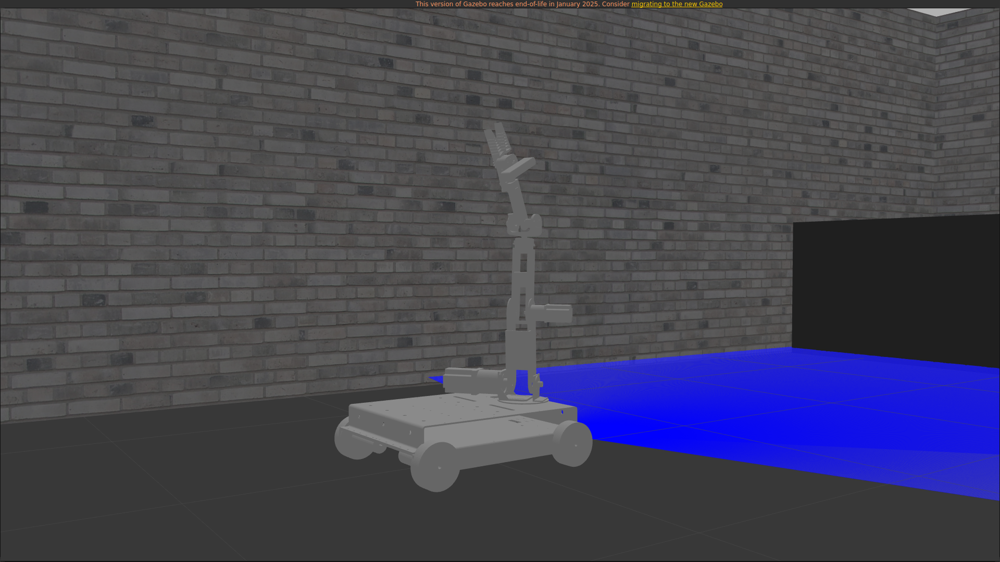
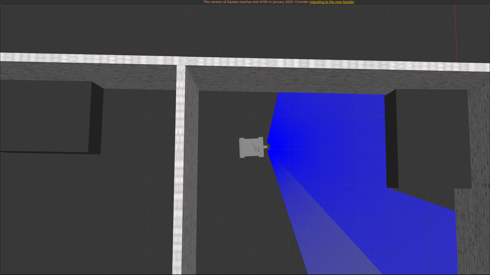

# RCup@Work Simulations ft.KARMA

> **⚠️ IMPORTANT NOTE:  GAZEBO MIGRATION**  
> We have migrated to **Gazebo Garden** as the Gazebo plugins are no longer supported in Gazebo Classic.There will be no more commits to this repo.The codes for Gazebo Garden simulation can be found [here](https://github.com/SanjayS66/karma_garden_simulations).

This repo will store all the Files including urdf,meshes,gazebo custom worlds,maps,launch files etc related to the simulations done on the KARMA bot.

NOTE : The URDF of the bot has plugins properly setup for the Base part only and not the arm part as it is not necessary for the auto navigation simulation

## SIMULATION IN GAZEBO :

